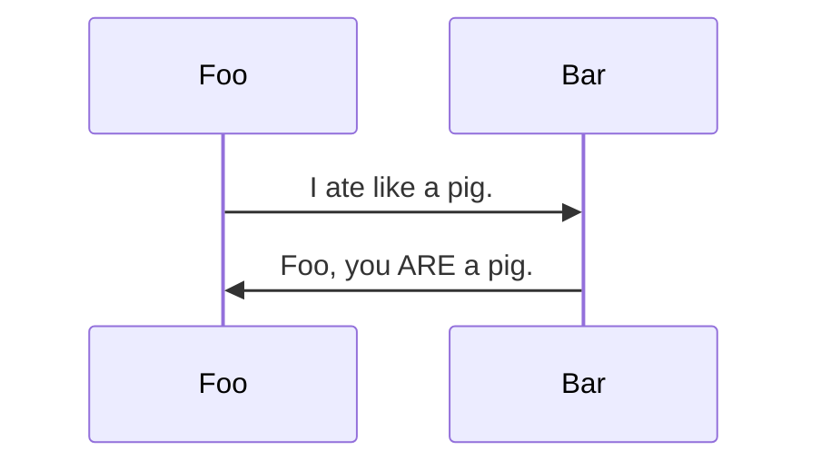

# &lt;zero-md&gt;

 


&color=lightgray>)

## Getting Started

- [Overview](#overview)
- [Installation](#installation)
- [Usage](#usage)
- [Baked-in features](#baked-in-features)

## Overview

> Ridiculously simple zero-config markdown displayer

A vanilla markdown-to-html web component based on
[Custom Elements V1 specs](https://www.w3.org/TR/custom-elements/) to load and display an external
MD file. Under the hood, it uses [`marked`](https://github.com/markedjs/marked) for super-fast
markdown transformation, and [`highlight.js`](https://github.com/highlightjs/highlight.js) for
lightning-quick syntax highlighting - automagically rendering into its own self-contained shadow DOM
container, while encapsulating implementation details into one embarrassingly easy-to-use package.

Featuring:

- Math rendering via [`KaTeX`](https://github.com/KaTeX/KaTeX)
- [`Mermaid`](https://github.com/mermaid-js/mermaid) diagrams
- Syntax highlighting via [`highlight.js`](https://github.com/highlightjs/highlight.js)
- Language detection for un-hinted code blocks
- Hash-link scroll handling
- FOUC prevention
- Auto re-render on input changes
- Light and dark themes
- Spec-compliant extensibility

> [!NOTE]  
> Your markdown file(s) must be hosted! Browsers restrict local file access in javascript because
> _security_. Standard [CORS](https://developer.mozilla.org/en-US/docs/Web/HTTP/CORS) rules apply.

## Installation

### Load via CDN (recommended)

`zero-md` is designed to be zero-config with good defaults. For most use-cases, just importing the
script from CDN and consuming the component directly should suffice.

```html
<head>
  ...
  <!-- Import element definition and auto-register -->
  <script type="module" src="https://cdn.jsdelivr.net/npm/zero-md@3?register"></script>
</head>
<body>
  ...
  <!-- Profit! -->
  <zero-md src="example.md"></zero-md>
</body>
```

> [!TIP]  
> To auto-register the custom element, import with `?register` query param.

The above can be re-written as:

```html
<head>
  ...
  <script type="module">
    // Import element definition
    import ZeroMd from 'https://cdn.jsdelivr.net/npm/zero-md@3'
    // Register
    customElements.define('zero-md', ZeroMd)
  </script>
</head>
```

### Use in web projects

Install the package.

```text
$ npm install zero-md
```

Import the class, register the element, use anywhere.

```js
// Import element definition
import ZeroMd from 'zero-md'

// Register custom element
customElements.define('zero-md', ZeroMd)

// Render anywhere
app.render(`<zero-md src=${src}></zero-md>`)
```

## Usage

### Display an external markdown file

```html
<!-- Simply set the `src` attribute and win -->
<zero-md src="https://example.com/markdown.md"></zero-md>
```

### Write markdown inline

<!--prettier-ignore-->
```html
<!-- Don't set the `src` attribute -->
<zero-md>
  <!-- Write your markdown inside a `<script type="text/markdown">` tag -->
  <script type="text/markdown">
# **This** is my [markdown](https://example.com)
  </script>
</zero-md>
```

By default, `<zero-md>` first tries to render `src`. If `src` is `falsy` (`undefined`, `404`, empty
file etc.), it **falls-back** to the contents inside the `<script type="text/markdown">` tag.

### Default style template

By default, `<zero-md>` displays markdown with a set of **default stylesheets** that mimics Github's
styles.

<!-- prettier-ignore -->
```html
<!-- By default, this... -->
<zero-md src="https://example.com/markdown.md"></zero-md>

<!-- ...is semantically equivalent to this -->
<zero-md src="https://example.com/markdown.md">
  <template>

    <!-- Sensible host style defaults -->
    <style>
      :host { display: block; position: relative; contain: content; }
      :host([hidden]) { display: none; }
    </style>

    <!-- Github markdown styles (light/dark) -->
    <link rel="stylesheet" href="https://cdn.jsdelivr.net/npm/github-markdown-css@5/github-markdown.min.css" />

    <!-- Highlightjs Github theme (light) -->
    <link rel="stylesheet" href="https://cdn.jsdelivr.net/npm/@highlightjs/cdn-assets@11/styles/github.min.css" />

    <!-- Highlightjs Github theme (prefers dark) -->
    <link rel="stylesheet" media="(prefers-color-scheme:dark)" href="https://cdn.jsdelivr.net/npm/@highlightjs/cdn-assets@11/styles/github-dark.min.css" />

    <!-- KaTeX styles (needed for math) -->
    <link rel="stylesheet" href="https://cdn.jsdelivr.net/npm/katex@0/dist/katex.min.css" />

  </template>
</zero-md>
```

### Use your own style template

To override defaults, supply your own style template.

```html
<zero-md src="https://example.com/markdown.md">
  <!-- Wrap with a <template> tag -->
  <template>
    <!-- Define your own styles inside a `<style>` tag -->
    <style>
      h1 {
        color: red;
      }
    </style>
    <!-- Or your own stylesheets with `<link>` tags -->
    <link rel="stylesheet" href="markdown-styles.css" />
    <link rel="stylesheet" href="highlight-styles.css" />
  </template>
</zero-md>
```

### Append or prepend a style template

To append styles **after** the default template (or prepend **before**), set `data-append` (or
`data-prepend`) to the `<template>` tag accordingly.

```html
<zero-md src="https://example.com/markdown.md">
  <!-- We apply this style template after defaults -->
  <template data-append>
    <style>
      h1 {
        color: red;
      }
    </style>
  </template>
</zero-md>
```

### Putting it all together

<!-- prettier-ignore -->
```html
<zero-md src="https://example.com/markdown.md">
  <template>
    <link rel="stylesheet" href="markdown-styles.css" />
    <style>
      h1 {
        color: red;
      }
    </style>
    <link rel="stylesheet" href="highlight-styles.css" />
    <style>
      code {
        background: yellow;
      }
    </style>
  </template>
  <script type="text/markdown">
This is the fall-back markdown that will **only show** when `src` is falsy.
  </script>
</zero-md>

<style>
  zero-md {
    display: block;
    position: relative;
  }
</style>
```

## Baked-in features

> [!NOTE]  
> For optimal performance, any required library is dynamically imported from CDN **only when the
> need arises**.

`<zero-md>` comes with a set of default `marked` settings, and first-class support for math and
diagram rendering via `katex` and `mermaidjs` respectively.

### Marked

The following extensions are loaded by default.

| Extension                                                                              | Description                                                                                     |
| -------------------------------------------------------------------------------------- | ----------------------------------------------------------------------------------------------- |
| [`marked-base-url`](https://github.com/markedjs/marked-base-url)                       | Sets the base url relative to `src` - this allows nested `md` files to work.                    |
| [`marked-highlight`](https://github.com/markedjs/marked-highlight)                     | Prepares syntax highlighting via [`highlight.js`](https://github.com/highlightjs/highlight.js). |
| [`marked-gfm-heading-id`](https://github.com/markedjs/marked-gfm-heading-id)           | Adds Github-styled element `id`s to headings.                                                   |
| [`marked-alert`](https://github.com/bent10/marked-extensions/tree/main/packages/alert) | Adds Github-styled [alerts](https://github.com/orgs/community/discussions/16925).               |

### Math

Write mathematic equations in LaTeX syntax, similar to
[how Github does so](https://docs.github.com/en/get-started/writing-on-github/working-with-advanced-formatting/writing-mathematical-expressions).

### Mermaid

Render mermaid diagrams with triple-backticks `mermaid` code blocks.

````text

````
